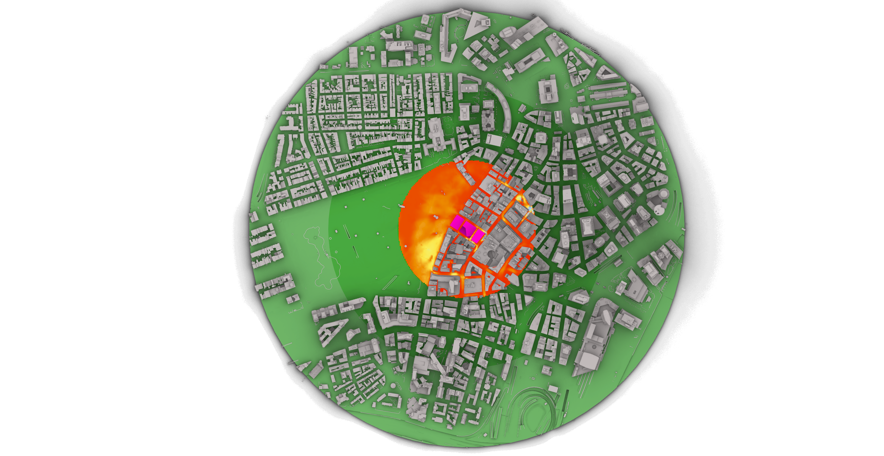

# External Building Aerodynamics

**Note:** This is a Windows only plugin
## SimScale-Grasshopper plugin
The use case this plugin is currenty developed for is to visulise SimScale results for wind speed within the Rhino environment using grasshopper. This use case includes also doing additional post processing to the results using Ladybug tools to produce outdoor thermal comfort parameters. We include a some examples of how this can be done, but its by no means an extensive overview of what can be done, and some expertise using Ladybug tools is recomended to perform the outdoor comfort calulations.

SimScale developed this plugin to help our users in the AEC industry to get more out of the results, and we see this plugin as a community contribution, where the coomunity is equally welcomed to maintain and improve it.

## Installation
1. Download the latest `.zip` file from [here](./latest_stable/latest_stable.zip)
2. Unzip the `.gha` and `.dll` files.
3. Copy the files to Grasshopper’s components folder:  
   `…/AppData/Roaming/Grasshopper/Libraries`
   **Note:** This is a hidden folder, so you may need to make it visible, on win10 view>Show/Hide>Hidden items=True
1. Download the API key file example `.simscale_api_keys.yaml` from [here](./examples/.simscale_api_keys.yaml)
	**Note:** Its really important to ensure the name is `.simscale_api_keys.yaml`
1. Copy the key file to the user's home directory, open it in a text editor, and paste your API key where indicated
4. Restart Rhino and Grasshopper...

## Examples
1. basic.gh - A very basic visulisation of wind speed, given a reference speed and direction
2. basic_humantosky_example.gh - This is the example of outdoor thermal comfort most easy to comprehend, with little complexities surrounding it. It is however rather slow to compute and we consider this a stepping stone in one ones learning journey
3. basic_radiance_example - Not yet developed

## First run
1. Download the geometry file `Boston.3dm` file from [here](./examples/Boston.3dm)
2. Download the application example `basic.gh` from [here](./examples/basic.gh)
3. Open the geometry file in Rhino, then open Grasshopper, there should be a SimScale tab
1. Open the example `basic.gh`
5. Set Project="Boston - WCD 2022", Simulation="Design 1", Simulation Run="Run 1"
1. Toggle the boolean toggle connected to the Download component
1. You should, after the procerss completes, see wind speed in the Rhino viewer, overlaid onto the geometry for context

## Notes for contributors
- Once a build is finalised, copy the bin folder over to latest stable, then zip it as a latest_stable.zip, tyhis should be automated at a later date